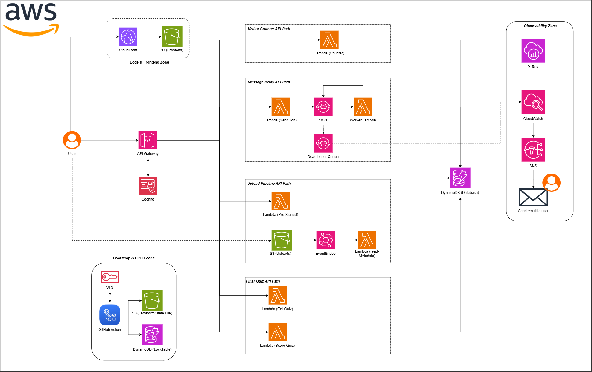

# ☁️ Aether Lab: Serverless AWS Portfolio

[](https://aws.amazon.com/)

[](https://www.terraform.io/)

[](https://github.com/features/actions)

[](https://react.dev/)

**Live Demo:** [sheshanhebron.com](https://sheshanhebron.com)
**Medium Article:** [Aether Lab: real AWS labs behind my portfolio]([https://sheshanhebron.com](https://medium.com/@sheshanhebron61/aether-lab-real-aws-labs-behind-my-portfolio-0b3a829590f8?sharedUserId=sheshanhebron61))


Aether Lab is my public proof-of-work: a production-grade portfolio site paired with interactive AWS labs. Instead of just reading an architecture diagram, visitors can trigger real cloud workflows, counters, asynchronous queues, direct S3 uploads, and authenticated APIs, and trace the backend execution path in real time.

Built with a strict **serverless-first** philosophy, this entire stack costs approximately **$5/month or less** to run, demonstrating that scalable cloud infrastructure doesn't require idle resources such as NAT Gateways, RDS instances, or EKS clusters.

---

## Architecture Overview



This project integrates **16 native AWS services** to build a fully serverless, observable, secure, and cost-conscious environment.

### 🧰 Tech Stack Arsenal

* **Compute & API:** AWS Lambda (ARM64 Graviton), Amazon API Gateway (HTTP API v2)
* **Storage & Database:** Amazon S3 (Frontend OAC, Inbox, Terraform State), Amazon DynamoDB (Single-table design, Terraform Lock)
* **Networking & Delivery:** Amazon CloudFront (CDN), AWS Certificate Manager (ACM), Cloudflare (DNS)
* **Security & Identity:** AWS IAM, AWS STS (OIDC), Amazon Cognito (User Pools & JWT)
* **Messaging & Events:** Amazon SQS (Jobs Queue & DLQ), Amazon EventBridge, Amazon SNS
* **Observability:** Amazon CloudWatch (Logs, Metrics, Dashboards, Alarms), AWS X-Ray (Active Tracing)
* **IaC & CI/CD:** Terraform, GitHub Actions

---

## ⚡ Live AWS Labs

The frontend interacts with the following backend workflows in real time:

* 📊 **Visitor Counter:** A synchronous flow where `POST /visits` hits API Gateway, triggering a Lambda function that performs an atomic increment in DynamoDB.

* 📨 **Message Relay (SQS + DLQ):** An asynchronous event-driven queue. API Gateway sends a payload to Amazon SQS and immediately returns a Job ID. A worker Lambda processes the queue, automatically routing poison messages to a Dead-Letter Queue (DLQ) after three failed retries.

* ☁️ **Upload Pipeline:** The browser requests a 60-second presigned URL from Lambda and uploads files directly into a private S3 Inbox bucket, bypassing API Gateway payload limits. S3 emits an `Object Created` event to EventBridge, triggering a worker Lambda that stores file metadata in DynamoDB.

* 🔐 **Pillar Quiz (Auth):** `GET /quiz` fetches questions publicly. Submitting answers requires a Cognito JWT `IdToken`. API Gateway's built-in JWT Authorizer validates the token and rejects unauthenticated requests with a `401 Unauthorized` response before Lambda is invoked.

---

## 🛡️ DevOps & Security Best Practices

This repository goes beyond basic deployment to demonstrate enterprise-grade engineering practices.

* 🔑 **Keyless CI/CD:** GitHub Actions authenticates directly to AWS using **OpenID Connect (OIDC)** and AWS STS. There are **zero** long-lived `AKIA` access keys stored in GitHub Secrets.

* 🏗️ **Infrastructure as Code (IaC):** 100% of the AWS infrastructure is codified in **Terraform**, utilizing a remote S3 backend for state storage and a DynamoDB table for concurrent state locking.

* 🔒 **Least Privilege:** Every Lambda function uses a custom IAM execution role scoped exclusively to the resources it requires.

* 🌐 **Secure Edge Delivery:** The React/Vite SPA is stored in a private S3 bucket and served globally through CloudFront using **Origin Access Control (OAC)**. The bucket blocks all public access.

* 📈 **Observability:** System health is monitored through custom CloudWatch dashboards, API Gateway access logs configured with seven-day retention for cost control, AWS X-Ray Active Tracing across services, and SNS email alerts triggered by SQS DLQ depth.

* 💰 **Cost Governance:** AWS Budgets are configured to alert on spending, helping ensure the project remains within the intended cost target.

---

## 💻 Local Development & Deployment

### Prerequisites

* [Node.js (v18+)](https://nodejs.org/)
* [Terraform (v1.7+)](https://developer.hashicorp.com/terraform/install)
* [AWS CLI](https://aws.amazon.com/cli/) configured with appropriate AWS credentials

### 1. Clone the Repository

```bash
git clone https://github.com/Sheshanadaf/aether-lab.git
cd aether-lab
```

### 2. Bootstrap Terraform

```bash
cd infra/bootstrap

cp terraform.tfvars.example terraform.tfvars

# Update terraform.tfvars with your details

terraform init
terraform apply
```

### 3. Deploy the Live Infrastructure

```bash
cd ../live

cp backend.hcl.example backend.hcl
cp terraform.tfvars.example terraform.tfvars

# Populate backend.hcl with the outputs from the bootstrap step

terraform init -backend-config=backend.hcl
terraform apply
```

### 4. Configure and Run the Frontend

```bash
cd ../../frontend

cp .env.example .env

# Set VITE_API_BASE and VITE_COGNITO_CLIENT_ID
# using the appropriate Terraform output values

npm install
npm run dev
```

---

